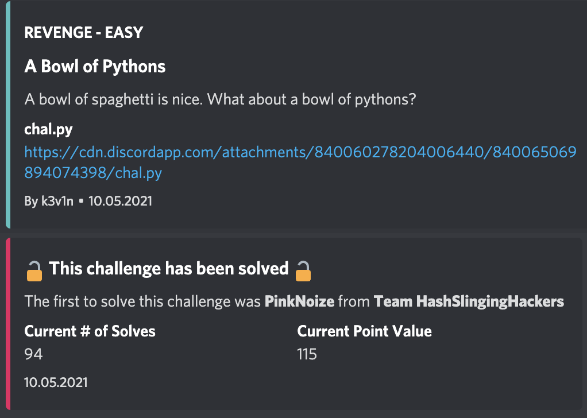

#San Diego CTF
## A Bowl of pythons

Category | Points 
--- | --- 
Revenge| 129



- In this task, we are given a python script, makes a flag inside and then compares it with an input
- First of all this is not the flag and it's a pity
```
FLAG = 'sdctf{a_v3ry_s3cur3_w4y_t0_st0r3_ur_FLAG}' # lol
```

- So if this script makes flag inside we can get it by small modifications
- Let's try to understand the code

```
if c[:6].encode().hex() != '{2}3{0}{1}{0}3{2}{1}{0}{0}{2}b'.format(*map(str, [6, 4, 7])):
```
- This line just checks that our answer begins from the `sdctf{`

- Okey we already have first part of our flag, and the last one obviously will `}`

- So we should calculate only middle part of the flag, I think we should find `h`

- Okey let's write tre script which will put the pieces of the flag together

```
start = b('{2}3{0}{1}{0}3{2}{1}{0}{0}{2}b'.format(*map(str, [6, 4, 7])))
middle = bytes((f[i] ^ (a(i) & 0xff)) for i in range(len(f)))
print(x + y.decode() + '}')
``` 

- Run the script and get the flag

flag=sdctf{v3ry-t4sty-sph4g3tt1}