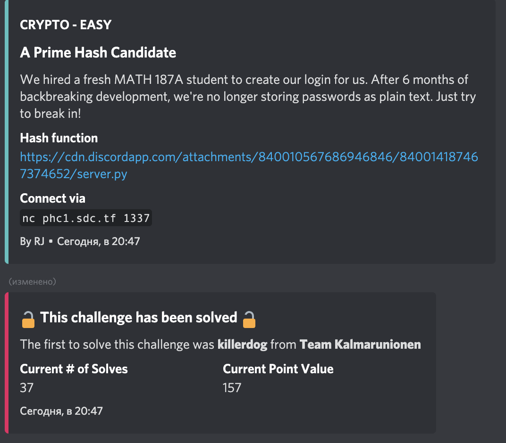
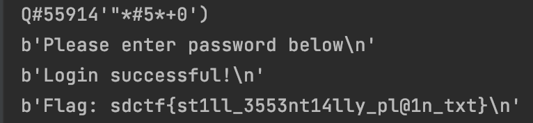

#San Diego CTF
## A Prime Hash Candidate

Category | Points 
--- | --- 
Crypto| 158



- In this task, we are given a python script

```
PASSWD = "59784015375233083673486266"

def hash(data):
    out = 0
    for c in data:
        out *= 31
        out += ord(c)
    return str(out)

```

- We have a function for generating a password hash, we need to write a function that will find a string corresponding to this hash

- Okey, look at the function `hash` it's not too mush helpful because codes of all printable symbols begin from 32 to 126
- You can check it here https://snipp.ru/handbk/table-ascii

- It means that we can represent all symbols in password in the form `value * 31 + number` 
where `number` is `PASSWD % 31`

- And `value` is `between 1 and 4` because `31 * 4` it's almost `126`

- So, let's write the code that can iterate over all possible passwords

```
PASSWD = "59784015375233083673486266"

def find_hash(data):
    out = 0
    for c in data:
        out *= 31
        out += ord(c)
    return str(out)

def get_password(password_hash, result):
    if password_hash == 0:
        return result[::-1]
    if password_hash < 0:
        return
    number = password_hash % 31
    for i in range(1, 5):
        temp_hash = (password_hash - (number + i * 31)) // 31
        temp_result = result + chr(i * 31 + number)
        temp_result = get_password(temp_hash, temp_result)
        if temp_result:
            return temp_result

def main():
    connection = netcat.Netcat(('phc1.sdc.tf', 1337))
    password = get_password(int(PASSWD), "")
    print(password)
    connection.sendline(password.encode())
    for i in range(1, 4):
        print(connection.recvline())


if __name__ == '__main__':
    main()
```
- And we get the flag 




flag=sdctf{st1ll_3553nt14lly_pl@1n_txt}