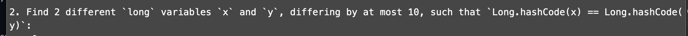

#San Diego CTF
## Alternative Arithmetic (Intermediate Flag)

Category | Points 
--- | --- 
Misc| 268


- Connect to server with `nc java.sdc.tf 1337`


- Okey, its quiz about Java, lets find out answer on first question, write the script on Java

```
for (long i = Long.MIN_VALUE; i < Long.MAX_VALUE; i++) {
    if (i == -i) {
        System.out.println(i);
    }
}
```


- Answer it's a `-9223372036854775808` and its a min long value in Java

- Okey, it was easy, because it's literally first number in this list,
because max long value is 2^63 - 1 and min long value is 2^63.
- So because of overflow `-(min long value) = (min long value)`

- We have second question



- Firstly, let's find out how works hash function for long  numbers in Java


- Okey, we see that we get xor of first and second parts of number 
- I had an idea, that we can check `0` and `-1`
- Really, `Long.hashCode(0)=0` what about -1? 
- If we do the above algorithm for `-1` we see, that `Long.hashCode(-1)=0`

- Answer is `0` and `-1`

- We have third question


- Okey, I guessed that question about rounding of long numbers in Java
- So when you add something small to a big float, it does not change, like `bigFloat + 1 = bigfloat`
- We should get enough big float and `start` won't increase, so the loop will return true
- Answer is `1e8f` and we get the flag

flag=sdctf{JAVA_Ar1thm3tIc_15_WEirD}