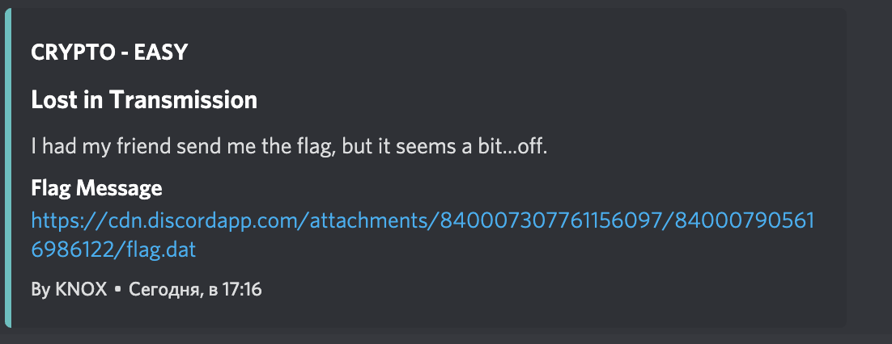
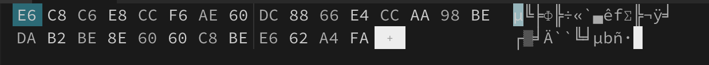

#San Diego CTF
## Lost in Transmission

Category | Points 
--- | --- 
Crypto| 95



- In task description we see a hint `a bit...of`
- We understood that we should see this line in HEX editor



- Okey, due to hint in description we also can think that some one bit is lost in transmission
- We try to shift all bits one by one on 1 bit and noticed that its the flag

```
f = open('flag.dat', 'rb')
string = f.read()
result = ''
for symbol in string:
    print(chr(symbol >> 1))
print(result)
``` 

- So let's modified our code

```
f = open('flag.dat', 'rb')
string = f.read()
result = ''
for symbol in string:
    result += chr(symbol >> 1)
print(result)
```

- We gwt the flag

flag=sdctf{W0nD3rfUL_mY_G00d_s1R}