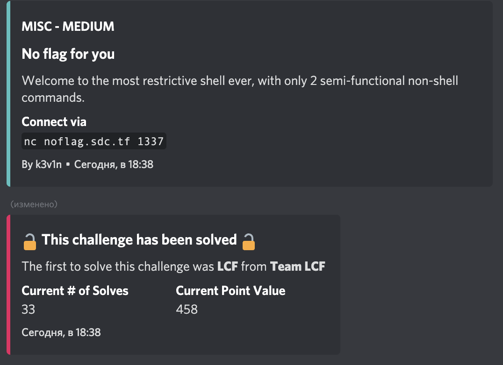
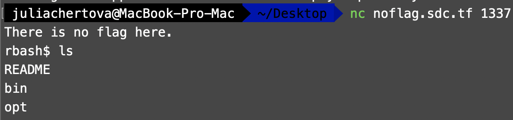
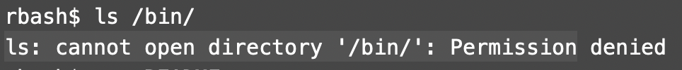
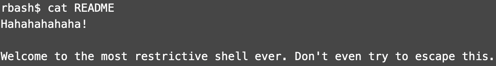
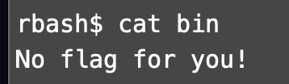
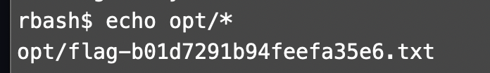
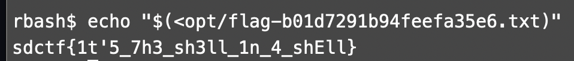

#San Diego CTF
## No flag for you

Category | Points 
--- | --- 
Misc| 460

- Connect to server with `nc noflag.sdc.tf 1337`

- Let's try to find out something about content with `ls`

- Let's try to find out content of a bin with `ls`

- Ok. `ls` is powerless here. We also have README. Let's try it with `cat`

- Let's try `cat` just in case

- Nothing. Ok we have one more option `echo *`. Let's try it

- Bingo! Let's get it out with `echo`

flag=sdctf{1t'5_7h3_sh3ll_1n_4_shEll}